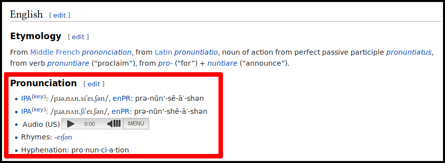

# wiktts 

Mining MediaWiki dumps to create better TTS engines (using Machine Learning)

* Version: 0.0.8
* Date: 2016-05-31
* Developer: [Alberto Pettarin](http://www.albertopettarin.it/)
* License: the MIT License (MIT)
* Contact: [click here](http://www.albertopettarin.it/contact.html)

## VERY IMPORTANT NOTICE

This is work in progress.
Code, tools, APIs, etc. are subject to change without any further notice.
Use at your own risk, until v1.0.0 is released (and this notice disappears).
Current TODO list:

* write a tool to diff IPA/mapped lexica, including a "consider one of the two lexica as ground truth" switch
* map eSpeak phones and/or create eSpeak voice from .symbol files


## Abstract 

MediaWiki sites (e.g.,
[Wikipedia](https://en.wikipedia.org/)
or
[Wiktionary](https://en.wiktionary.org/)
) contain a lot of information about
the **pronunciation of words in several languages**:



This information is described by "pronunciation tags",
which contain the **phonetic/phonemic transcription** of the word,
written using the
[**International Phonetic Alphabet**](https://en.wikipedia.org/wiki/International_Phonetic_Alphabet)
(IPA):

```
===Pronunciation===
* {{IPA|/pɹəˌnʌn.siˈeɪ.ʃən/|lang=en}}, {{enPR|prə-nŭn'-sē-ā′-shən}}
* {{IPA|/pɹəˌnʌn.ʃiˈeɪ.ʃən/|lang=en}}, {{enPR|prə-nŭn'-shē-ā′-shən}}
* {{audio|En-us-pronunciation.ogg|Audio (US)|lang=en}}
* {{rhymes|eɪʃən|lang=en}}
* {{hyphenation|pro|nun|ci|a|tion|lang=en}}
```

This project provides tools to **extract** pronunciation information
from MediaWiki dump files, to **clean** the mined IPA strings,
and to **prepare** input files for **Machine Learning (ML) tools**
used in computation linguistics and speech processing.

Possible **applications** include:

* improving existing open source/free software Text-To-Speech (TTS) tools,
  for example
  [espeak-ng](https://github.com/espeak-ng/espeak-ng) or
  [idlak](https://github.com/bpotard/idlakhttps://github.com/bpotard/idlak),
  by incorporating the mined pronunciation lexica and/or
  Letter-To-Sound/Grapheme-To-Phoneme (LTS/G2P) models trained
  from the mined pronunciation lexica;
* creating TTS voices for "minority" languages;
* creating MediaWiki bots to add a (tentative) IPA transcription to Wiktionary articles missing it;
* creating MediaWiki bots to review the existing IPA transcription provided by a human editor;
* building a crowdsourced CAPTCHA-like service to further refine the transcriptions and hence the derived models;
* research projects in linguistics, phonology, natural language processing, speech synthesis, and speech processing.


## In The Box

This repository contains the following Python 2.7.x/3.5.x tools:

* ``wiktts.mw.splitter`` split a [MediaWiki dump](https://dumps.wikimedia.org/backup-index.html) into chunks
* ``wiktts.mw.miner``: mine [IPA](http://www.internationalphoneticassociation.org/) strings from a MediaWiki dump file
* ``wiktts.lexcleaner``: clean+normalize a pronunciation lexicon
* ``wiktts.trainer``: prepare train/test/symbol sets for ML tools (e.g., Phonetisaurus or Sequitur)

This project uses the sister ``ipapy`` Python module,
available on [PyPI](https://pypi.python.org/pypi/ipapy)
and [GitHub](https://github.com/pettarin/ipapy),
under the same license (MIT License).
The ``ipapy`` module is released and maintained on a separate GitHub repository,
since it might be used in applications other than ``wiktts``,
although the development of ``ipapy`` is currently heavily influenced by the needs of ``wiktts``.


## Dependencies

1. Python 2.7.x or 3.5.x
2. Python module ``lxml`` (``pip install lxml``)
3. Python module ``ipapy`` (``pip install ipapy``)


## Installation

1. Install the dependencies listed above. 

2. Clone this repo:
    ```bash
    $ git clone https://github.com/pettarin/wiktts.git
    ```

3. Download the dump(s) you want to work on from [Wikimedia Downloads](https://dumps.wikimedia.org/backup-index.html):
    ```bash
    $ cd wiktts/dumps
    $ wget "https://dumps.wikimedia.org/enwiktionary/20160407/enwiktionary-20160407-pages-meta-current.xml.bz2"
    ```

4. Install the ML tool(s) you want to work with.
   Currently, ``wiktts.trainer`` outputs in formats readable by:
    * [Phonetisaurus](https://github.com/AdolfVonKleist/Phonetisaurus)
    * [Sequitur](https://www-i6.informatik.rwth-aachen.de/web/Software/g2p.html)


## Usage

### wiktts.mw.splitter

```bash
$ python -m wiktts.mw.splitter DUMP.XML[.BZ2] [OPTIONS]
```

[Details](wiktts/mw/splitter/README.md)

### wiktts.mw.miner

```bash
$ python -m wiktts.mw.miner PARSER DUMP [OPTIONS]
```

[Details](wiktts/mw/miner/README.md)

### wiktts.lexcleaner

```bash
$ python -m wiktts.lexcleaner LEXICON [OPTIONS]
```

[Details](wiktts/lexcleaner/README.md)

### wiktts.trainer

```bash
$ python -m wiktts.trainer TOOL LEXICON OUTPUTDIR [OPTIONS]
```

[Details](wiktts/trainer/README.md)


## Putting All Together 

Note: you might want to use tmux/screen since some of the following commands
will require several minutes/hours to run.

```bash
$ # clone the repo
$ git clone https://github.com/pettarin/wiktts.git
$ cd wiktts/dumps

$ # download the English Wiktionary dump (minutes)
$ wget "https://dumps.wikimedia.org/enwiktionary/20160407/enwiktionary-20160407-pages-meta-current.xml.bz2"
$ cd ..

$ # extract the IPA strings (minutes)
$ python -m wiktts.mw.miner enwiktionary dumps/enwiktionary-20160407-pages-meta-current.xml.bz2 --output-file /tmp/enwiktionary-20160407.lex

$ # clean the mined (word, IPA) pairs (minutes)
$ python -m wiktts.lexcleaner /tmp/enwiktionary-20160407.lex --output-file /tmp/enwiktionary-20160407.lex.clean

$ # create train/test/symbol files for Sequitur G2P (minutes)
$ python -m wiktts.trainer sequitur /tmp/enwiktionary-20160407.lex.clean /tmp/

$ # train a G2P model using Sequitur G2P (hours)
$ cd /tmp
$ bash run_sequitur.sh train

$ # self-test the trained G2P model
$ bash run_sequitur.sh test

$ # apply the trained G2P model to the given lexicon
$ bash run_sequitur.sh apply new_words.txt
```


## License

**wiktts** is released under the MIT License.


## References

See the [REFERENCES file](REFERENCES.md).


## Acknowledgments

* Many thanks to [Dr. Tony Robinson](https://www.speechmatics.com/) for many useful discussions about this project.


